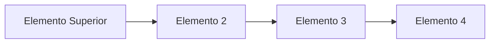

Pilas (Las estructuras de datos más básicas)

Las estructuras de datos son una colección organizada de datos para almacenar, recuperar y manipular información de manera eficiente. Estas estructuras incluyen listas enlazadas, pilas, colas, árboles, matrices, grafos y tablas de hash. Cada estructura de datos tiene sus propias características y usos, lo que permite a los programadores elegir la estructura de datos adecuada para cada situación. Estas estructuras también se pueden combinar para producir soluciones de programación más complejas.

Pilas (Stack)

Una pila o Stack es una estructura de datos basada en la idea de LIFO (Last In, First Out). Esto significa que el elemento que fue agregado más recientemente es el primero en ser retirado. Esta estructura de datos se usa comúnmente para almacenar y manipular datos de forma ordenada y eficiente. Por ejemplo, se pueden usar para deshacer operaciones, almacenar llamadas a funciones y almacenar datos en un orden específico.

Algunas caracteristicas de una Pila son:

- Es una estructura de datos LIFO (Last In, First Out).
- Esta estructura solo permite el acceso a un elemento: el elemento superior.
- Solo se pueden realizar dos operaciones principales: push (agregar un elemento) y pop (eliminar un elemento).
- Un Stack está diseñado para ser una estructura de datos eficiente.
- Los stacks se usan comúnmente para implementar recursividad y para almacenar datos en un orden específico.

Cuales son los metodos principales que deben ser implementados cuando implementamos un stack?

- Push: agregar un elemento al stack.
- Pop: eliminar el elemento superior.
- peek (también conocido como top): obtener el elemento superior sin eliminarlo.
- empty (también conocido como isEmpty): verificar si el stack está vacío o no.
- size: obtener el tamaño del stack.

Puedes dibujar un diagrama en markdown que explique como es un stack?



El diagrama de arriba muestra un stack de 4 elementos, donde el elemento superior (A) es el primero en ser eliminado.

Aquí hay un ejemplo de código de un stack escrito en Go:

``` go

package main

import (
	"fmt"
)

// Libro es una estructura para almacenar información de libros
type Libro struct {
	Título  string
	Autor   string
	Páginas int
}

// StackLibros es una estructura de datos que permite la inserción y eliminación de libros
// utilizando el principio LIFO (Last In First Out).
type StackLibros struct {
	data []Libro
}

// Push agrega un libro al stack
func (s *StackLibros) Push(value Libro) {
	s.data = append(s.data, value)
}

// Pop elimina el elemento superior del stack
func (s *StackLibros) Pop() Libro {
	if len(s.data) == 0 {
		return Libro{}
	}

	value := s.data[len(s.data)-1]
	s.data = s.data[:len(s.data)-1]
	return value
}

// Peek obtiene el elemento superior del stack sin eliminarlo
func (s *StackLibros) Peek() Libro {
	if len(s.data) == 0 {
		return Libro{}
	}

	return s.data[len(s.data)-1]
}

// Empty verifica si el stack está vacío o no
func (s *StackLibros) Empty() bool {
	return len(s.data) == 0
}

// Size obtiene el tamaño del stack
func (s *StackLibros) Size() int {
	return len(s.data)
}

func main() {
	s := StackLibros{}
	s.Push(Libro{"Cien años de soledad", "Gabriel García Márquez", 417})
	s.Push(Libro{"El principito", "Antoine de Saint-Exupéry", 77})
	s.Push(Libro{"El alquimista", "Paulo Coelho", 163})

	fmt.Println("Tamaño del stack:", s.Size())
	fmt.Println("Elemento superior:", s.Peek().Título)

	for !s.Empty() {
		libro := s.Pop()
		fmt.Printf("Título: %s, Autor: %s, Páginas: %d\n", libro.Título, libro.Autor, libro.Páginas)
	}
}
```

Porque un Stack es la base de otras estructuras de datos mas complejas?

Un stack es una estructura de datos muy simple que puede servir como la base para la construcción de estructuras de datos más complejas como los árboles, pilas y colas. Esto se debe a que el stack ofrece una forma eficiente de almacenar y manipular datos. Además, los stacks se usan comúnmente para implementar recursividad, lo que hace que sea una herramienta útil para la creación de estructuras de datos más complejas.

Un poco de historia

El Stack se remonta a los primeros días de la informática, La primera implementación de la estructura Stack se atribuye a Alan M. Turing en 1945. Cuando los programadores trataban de encontrar la mejor forma de almacenar y manipular datos de manera eficiente. El principio LIFO (Last In, First Out) fue desarrollado para crear una estructura de datos eficiente, en la que el último elemento agregado es el primero en ser eliminado.

Con el tiempo, el stack se ha convertido en una herramienta básica para la construcción de estructuras de datos más complejas como los árboles, pilas y colas. Se usa comúnmente para implementar recursividad y para almacenar datos en un orden específico.

En la actualidad, el stack sigue siendo una de las estructuras de datos más utilizadas en la ingeniería de software.

En conclusión la estructura Stack es una estructura de datos muy útil y ampliamente utilizada para almacenar y organizar información. Ofrece una forma fácil de guardar y recuperar los datos de forma eficiente. Esta estructura es esencial para la programación, ya que permite a los programadores implementar una variedad de soluciones de problemas. Además, la estructura Stack es una herramienta indispensable para la implementación de algoritmos recursivos.

A continuación te dejo 1 ejercicio para que practiques la estructura "Stack" en Go y envies la solucion como un Pull requeste a este repositorio:

1. Crea una estructura Stack en Go para almacenar los nombres de los animales y agrega los elementos 'Perro', 'Gato', 'Conejo' y 'Loro' a la pila.